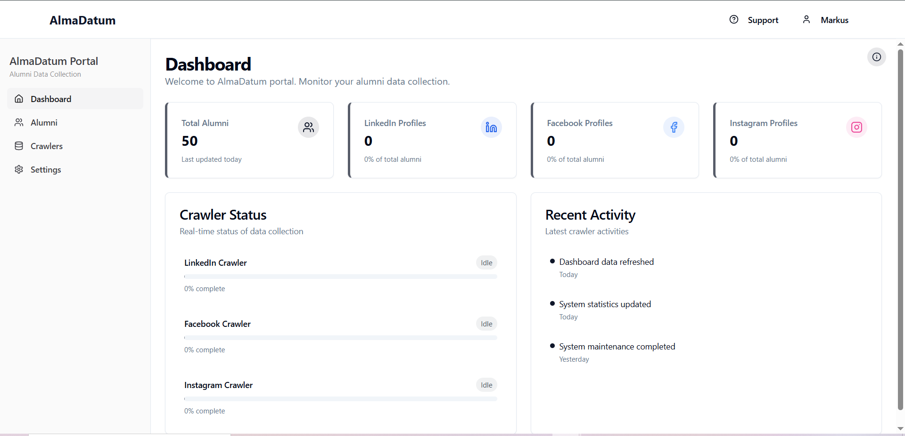

<div align="center">
  <h1>🎓 AlmaDatum</h1>
  <p><strong>Professional Alumni Data Collection & Management Portal</strong></p>
  
  
  
  <p>
    
    
    
    
    
  </p>
</div>

## 📋 Table of Contents

- [Overview](#-overview)
- [Features](#-features)
- [Screenshots](#-screenshots)
- [Tech Stack](#-tech-stack)
- [Installation](#-installation)
- [Configuration](#-configuration)
- [Usage](#-usage)
- [API Integration](#-api-integration)
- [Crawler Limitations](#-crawler-limitations)
- [Import/Export Features](#-importexport-features)
- [Advanced Filtering](#-advanced-filtering)
- [User Management](#-user-management)
- [Contributing](#-contributing)
- [License](#-license)

## 🎯 Overview

**AlmaDatum** is a comprehensive alumni data collection and management portal designed for educational institutions. It provides an intuitive interface for tracking alumni information, automating data collection through web crawlers, and maintaining comprehensive alumni databases with social media profile integration.

The platform combines automated data collection capabilities with manual data entry options, offering flexibility for institutions of all sizes to maintain up-to-date alumni records.

## ✨ Features

### 🏠 Dashboard & Analytics
- **Real-time Statistics**: Monitor total alumni count, social media profile coverage
- **Crawler Status Monitoring**: Track LinkedIn, Facebook, and Instagram crawler activities
- **Activity Logs**: View recent system activities and data updates
- **Platform Coverage Analytics**: Visualize alumni presence across different social platforms

### 👥 Alumni Management
- **Comprehensive Profile Management**: Store detailed alumni information including:
  - Personal details (name, batch, department, email)
  - Professional information (company, position)
  - Social media profiles (LinkedIn, Facebook, Instagram)
- **Advanced Search & Filtering**: Multi-criteria search and filtering capabilities
- **Bulk Operations**: Import/export large datasets efficiently
- **Real-time Updates**: Live data synchronization across the platform

### 🤖 Automated Data Collection
- **Multi-Platform Crawlers**: Automated data collection from:
  - LinkedIn profiles
  - Facebook profiles  
  - Instagram profiles
  - University alumni websites
- **Smart Data Parsing**: Intelligent extraction of alumni information
- **Duplicate Detection**: Automatic identification and handling of duplicate entries
- **Progress Tracking**: Real-time crawler status and completion monitoring

### 📊 Data Import/Export
- **CSV Import/Export**: Seamless data transfer with standardized formats
- **Website Login Import**: Direct data extraction from password-protected alumni portals
- **Manual Data Entry**: User-friendly forms for individual alumni addition
- **Batch Processing**: Efficient handling of large datasets

## 📸 Screenshots

### Dashboard Overview

*Main dashboard showing alumni statistics and crawler status*

### Alumni Database

*Comprehensive alumni listing with search and filter capabilities*

### Import/Export Interface

*Data import/export functionality with multiple options*

### User Management

*Administrative interface for managing system users and permissions*

## 🛠️ Tech Stack

### Frontend
- **React 18** with TypeScript
- **Tailwind CSS** for styling
- **Shadcn/UI** for component library
- **React Router** for navigation
- **Zustand** for state management

### Backend
- **Node.js** with Express.js
- **MongoDB** with Mongoose ODM
- **RESTful API** architecture
- **JWT Authentication**

### Tools & Libraries
- **Lucide React** for icons
- **React Hook Form** for form handling
- **Axios** for API calls
- **Date-fns** for date manipulation

## 🚀 Installation

### Prerequisites
- Node.js (v16 or higher)
- MongoDB (v4.4 or higher)
- npm or yarn package manager

### Clone Repository
```bash
git clone https://github.com/danish296/project-insight-wizard.git
cd project-insight-wizard
```

### Frontend Setup
```bash
# Install frontend dependencies
npm install

# Start development server
npm run dev
```

### Backend Setup
```bash
# Navigate to backend directory
cd backend

# Install backend dependencies
npm install

# Start backend server
npm start
```

### Environment Configuration
Create a `.env` file in the backend directory:

```env
# Database Configuration
MONGODB_URI=mongodb://localhost:27017/almadatum

# Server Configuration
PORT=5000
NODE_ENV=development

# Authentication
JWT_SECRET=your_jwt_secret_key
JWT_EXPIRE=7d

# Social Media API Keys (Optional)
LINKEDIN_API_KEY=your_linkedin_api_key
FACEBOOK_API_KEY=your_facebook_api_key
INSTAGRAM_API_KEY=your_instagram_api_key
```

## ⚙️ Configuration

### Database Setup
```bash
# Start MongoDB service
sudo systemctl start mongod

# Create database and collections
mongosh
use almadatum
db.createCollection("alumni")
db.createCollection("users")
```

### Default Admin Account
- **Email**: `admin@college.edu`
- **Password**: `password`
- **Role**: Admin with full permissions

## 📖 Usage

### Starting the Application
1. **Start Backend Server**:
   ```bash
   cd backend && npm start
   ```

2. **Start Frontend Development Server**:
   ```bash
   npm run dev
   ```

3. **Access Application**: Navigate to `http://localhost:3000`

### Basic Workflow
1. **Login** with admin credentials
2. **Configure Crawlers** in the settings panel
3. **Import Initial Data** using CSV upload or website crawling
4. **Monitor Progress** through the dashboard
5. **Manage Alumni** using the comprehensive database interface

## 🔌 API Integration

### Alumni API Endpoints
```typescript
// Get all alumni
GET /api/alumni

// Create new alumni
POST /api/alumni
{
  "name": "John Doe",
  "batch": "2024",
  "department": "Computer Science",
  "email": "john.doe@example.com",
  "company": "Tech Corp",
  "position": "Software Engineer"
}

// Update alumni
PUT /api/alumni/:id

// Delete alumni
DELETE /api/alumni/:id

// Import bulk alumni
POST /api/alumni/import
```

### LinkedIn API Integration (LixB2B Approach)
The system implements a strategic approach for LinkedIn data collection:

```typescript
// LinkedIn profile extraction
const linkedinCrawler = {
  async extractProfile(profileUrl: string) {
    // Respectful API rate limiting
    await this.rateLimiter.acquire();
    
    // Extract public profile information
    const profile = await this.parsePublicProfile(profileUrl);
    
    return {
      name: profile.name,
      company: profile.currentCompany,
      position: profile.currentPosition,
      education: profile.education
    };
  }
};
```

**Note**: LinkedIn integration follows their Terms of Service and focuses on publicly available information only.

## ⚠️ Crawler Limitations

### Technical Limitations
- **Rate Limiting**: Crawlers implement respectful delays to avoid overwhelming target servers
- **IP Blocking**: Extended use may trigger anti-bot measures
- **Dynamic Content**: JavaScript-heavy sites may require additional processing time
- **Authentication**: Some alumni portals require valid credentials

### Platform-Specific Constraints

#### LinkedIn
- **API Rate Limits**: 500 requests per day for basic tier
- **Profile Privacy**: Only public profiles are accessible
- **Connection Requirements**: Some profiles require network connections

#### Facebook
- **Privacy Settings**: Most profiles are private by default
- **API Restrictions**: Limited access to public pages only
- **Graph API Limits**: 200 calls per hour per user

#### Instagram
- **Business Accounts Only**: Personal accounts have limited data access
- **Media Focus**: Platform optimized for visual content, not professional data

### Recommended Best Practices
```typescript
// Implement exponential backoff
const crawlerConfig = {
  retryDelay: 1000,
  maxRetries: 3,
  respectRobotsTxt: true,
  userAgent: 'AlmaDatum-Bot/1.0',
  concurrent: 2 // Maximum concurrent requests
};
```

## 📥📤 Import/Export Features

### CSV Import Specifications
```csv
name,email,batch,department,company,position,profiles
John Doe,john@example.com,2024,Computer Science,Tech Corp,Developer,"linkedin;facebook"
Jane Smith,jane@example.com,2023,Engineering,StartupXYZ,Manager,"linkedin"
```

#### Required Columns
- `name` (Required)
- `email` (Required)

#### Optional Columns
- `batch`, `department`, `company`, `position`
- `profiles` (semicolon-separated social media profiles)

### Website Login Import


```typescript
// Website crawling configuration
const websiteImport = {
  url: "https://university.edu/alumni",
  credentials: {
    username: "your_username",
    password: "your_password"
  },
  selectors: {
    nameField: ".alumni-name",
    emailField: ".alumni-email",
    batchField: ".graduation-year"
  }
};
```

### Export Formats
- **CSV**: Compatible with Excel and Google Sheets
- **JSON**: For programmatic access
- **PDF**: Formatted reports for presentation

## 🔍 Advanced Filtering

### Multi-Criteria Search
```typescript
interface FilterCriteria {
  batch?: string[];
  department?: string[];
  company?: string[];
  position?: string[];
  hasLinkedIn?: boolean;
  hasFacebook?: boolean;
  hasInstagram?: boolean;
  lastUpdated?: DateRange;
}
```

### Filter Examples
- **By Graduation Year**: Filter alumni from specific batches
- **By Department**: Computer Science, Engineering, Business, etc.
- **By Company**: Current or previous employers
- **By Social Presence**: Alumni with specific social media profiles
- **By Last Update**: Recently updated vs. stale records

### Search Operators
- **Exact Match**: "Software Engineer"
- **Partial Match**: Engineer (matches Software Engineer, Data Engineer, etc.)
- **Multiple Values**: Computer Science OR Information Technology
- **Date Ranges**: Updated within last 30 days

## 👤 User Management


### Role-Based Access Control
```typescript
interface UserPermissions {
  canCreateUsers: boolean;
  canDeleteAlumni: boolean;
  canModifySettings: boolean;
  canExportData: boolean;
  canImportData: boolean;
  canRunCrawlers: boolean;
}

// User roles
const roles = {
  admin: "Full system access",
  manager: "Alumni management and reports",
  viewer: "Read-only access to alumni data"
};
```

### User Management Features
- **Multi-user Support**: Add team members with different access levels
- **Permission Management**: Granular control over user capabilities
- **Activity Tracking**: Monitor user actions and system changes
- **Secure Authentication**: JWT-based authentication with session management

## 🤝 Contributing

We welcome contributions to AlmaDatum! Here's how you can help:

### Development Setup
```bash
# Fork the repository
git clone https://github.com/yourusername/project-insight-wizard.git

# Create feature branch
git checkout -b feature/amazing-feature

# Make changes and commit
git commit -m "Add amazing feature"

# Push to branch
git push origin feature/amazing-feature

# Create Pull Request
```

### Code Standards
- **TypeScript**: All new code should be written in TypeScript
- **ESLint**: Follow the existing linting configuration
- **Testing**: Add tests for new features
- **Documentation**: Update README and inline documentation

### Areas for Contribution
- Additional social media platform integrations
- Enhanced data visualization features
- Mobile application development
- API improvements and optimizations
- UI/UX enhancements

## 📄 License

This project is licensed under the MIT License - see the [LICENSE](LICENSE) file for details.

## 🆘 Support

### Documentation
- [User Guide](docs/user-guide.md)
- [API Documentation](docs/api.md)
- [Deployment Guide](docs/deployment.md)

### Community
- [GitHub Issues](https://github.com/danish296/project-insight-wizard/issues)
- [Discussions](https://github.com/danish296/project-insight-wizard/discussions)

### Contact
- **Developer**: [danish296](https://github.com/danish296)
- **Email**: support@almadatum.com

---

<div align="center">
  <p>Made with ❤️ for educational institutions worldwide</p>
  <p>© 2025 AlmaDatum. All rights reserved.</p>
</div>
